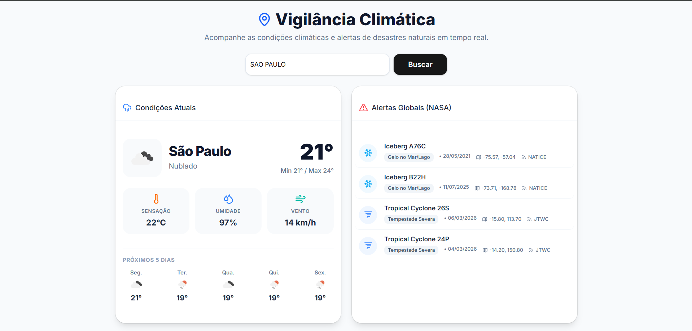

# 🌍 Vigilância Climática

### Dashboard Meteorológico & Monitoramento de Desastres Naturais


---

## 📌 Sobre o Projeto

O **Vigilância Climática** é uma aplicação web focada no **monitoramento meteorológico em tempo real** e no **rastreamento global de desastres naturais**.

A plataforma integra dados provenientes de **APIs oficiais**, oferecendo uma interface moderna, rápida e responsiva para visualização de informações climáticas e eventos naturais relevantes ao redor do mundo.

O projeto foi desenvolvido com foco em:

* **Performance**
* **Experiência do usuário (UX)**
* **Arquitetura escalável**
* **Boas práticas do ecossistema React/Next.js**

---

## 🚀 Tecnologias Utilizadas

**Frontend**

* Next.js 14 (App Router)
* React 18
* TypeScript

**UI & Estilização**

* Tailwind CSS
* Shadcn UI
* Lucide React (ícones)

**APIs Utilizadas**

* [OpenWeather API](https://openweathermap.org/api)
  Dados climáticos atuais e previsão de 5 dias

* [NASA EONET v2.1](https://eonet.gsfc.nasa.gov/)
  Monitoramento global de eventos naturais extremos

---

# 🧠 Arquitetura e Decisões Técnicas

O projeto foi estruturado com foco em **performance, resiliência e experiência do usuário**, utilizando recursos modernos do **Next.js App Router**.

---

## 1️⃣ Estratégias de Cache (Next.js)

Para reduzir o número de requisições externas e melhorar a performance da aplicação, foram aplicadas diferentes estratégias de cache.

**Previsão do tempo**

Utiliza **revalidação baseada em tempo**:

```ts
revalidate: 3600
```

Isso permite que os dados sejam atualizados automaticamente a cada **1 hora**, evitando chamadas desnecessárias à API da OpenWeather.

**Eventos da NASA**

Para garantir dados sempre atualizados:

```ts
cache: "no-store"
```

Assim, alertas críticos globais são sempre renderizados com as **informações mais recentes diretamente do servidor**.

---

## 2️⃣ Gerenciamento de Estado e UX

Para melhorar a experiência do usuário durante o carregamento dos dados:

* Utilização de **React Suspense**
* Implementação de **Skeleton Screens** (Shadcn UI)

Isso permite que a interface principal carregue rapidamente enquanto dados mais pesados (como eventos da NASA) são processados em background.

Além disso, o hook **`useFormStatus`** foi utilizado para gerenciar estados de submissão no formulário de busca de cidades, fornecendo feedback visual imediato ao usuário.

---

## 3️⃣ Tratamento de Erros e Resiliência

Para garantir maior robustez da aplicação, foi implementado tratamento de erros no lado do servidor utilizando blocos **`try/catch`**.

Falhas em APIs externas, como:

* Cidade não encontrada na OpenWeather
* Instabilidades temporárias na API da NASA

são tratadas e exibidas através de **componentes visuais amigáveis**, evitando que erros comprometam o restante da interface.

---

## 4️⃣ Acessibilidade e Localização

### 🌐 Tradução Dinâmica

As categorias retornadas pela API da NASA são originalmente fornecidas em inglês.
Esses dados são interceptados e **traduzidos dinamicamente para Português (pt-BR)** antes da renderização.

### ♿ Acessibilidade

Foram adicionados **tooltips nativos (`title`)** em ícones e métricas meteorológicas, facilitando a interpretação das informações por parte do usuário.

---

# ⚙️ Executando o projeto localmente

Clone o repositório:

```bash
git clone https://github.com/SEU_USUARIO/SEU_REPOSITORIO.git
```

Entre na pasta do projeto:

```bash
cd SEU_REPOSITORIO
```

Instale as dependências:

```bash
npm install
```

Execute o projeto:

```bash
npm run dev
```

---

💡 A aplicação estará disponível em:

```
http://localhost:3000
```

---

## 📷 Preview



---

## 📄 Licença

Este projeto está sob a licença MIT.

---